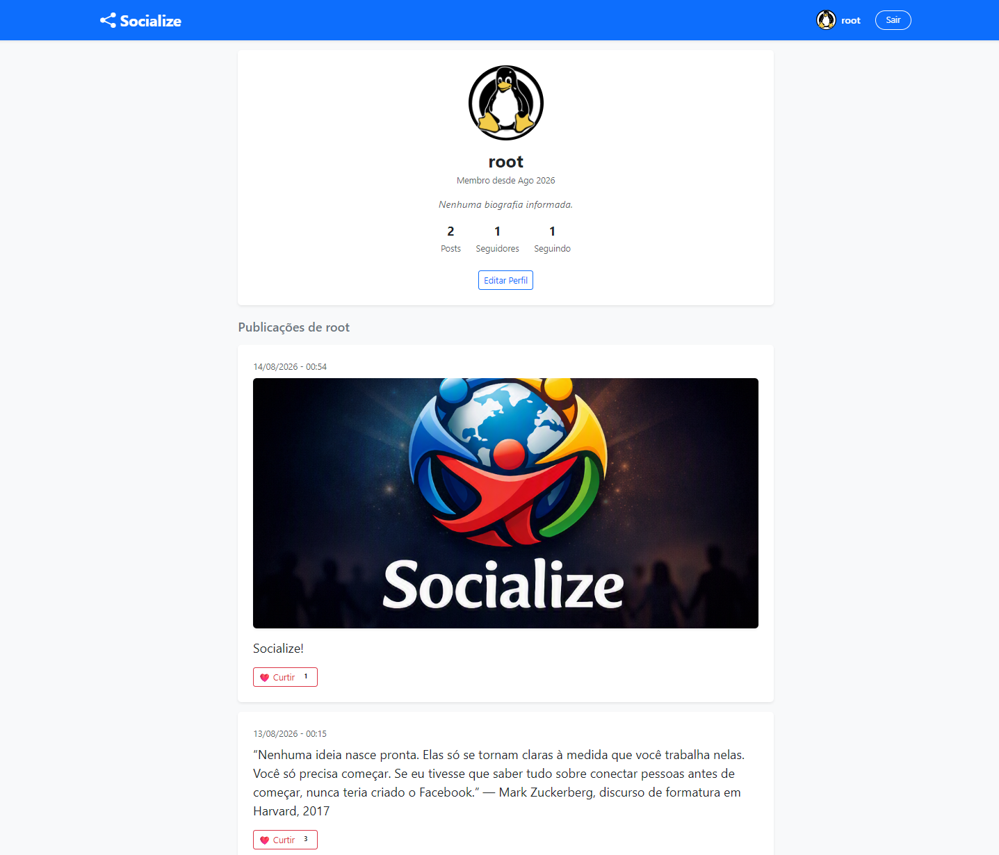
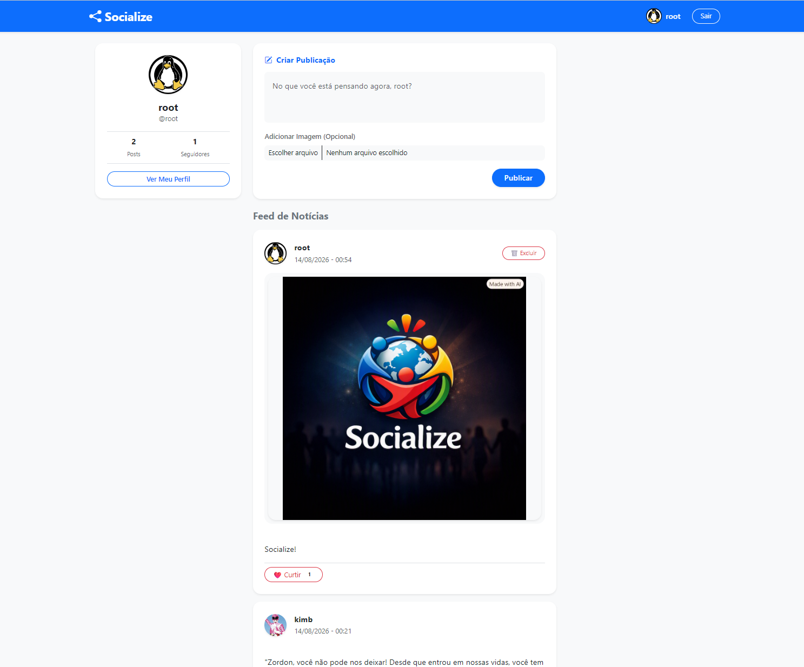

# 🌐 Socialize - Rede Social em Django

O **Socialize** é uma aplicação web de rede social desenvolvida em Python e Django. O projeto foi projetado com foco em boas práticas de arquitetura, modularização de apps, relacionamentos de banco de dados, autenticação de usuários, versionamento profissional e integração com serviços em nuvem.

---




## 🚀 Funcionalidades

### 👤 Autenticação e Perfis de Usuário
- **Cadastro e Login:** Validação de credenciais e senhas coincidentes.
- **Criação Automática de Perfil:** Utilização de *Django Signals* para gerar o perfil automaticamente após o registro.
- **Página de Perfil (`/profile/<username>/`):** Visualização de dados do usuário, biografia, foto de perfil (avatar), histórico de posts e contadores.
- **Edição de Perfil:** Atualização de foto e biografia com suporte a upload de arquivos integrado à nuvem.
- **Exclusão de Conta:** Exclusão em cascata do usuário e todos os seus dados associados.

### 📝 Posts e Feed
- **Criação de Publicações:** Publicação de textos no Feed principal associados corretamente ao perfil do autor.
- **Feed de Notícias:** Exibição ordenada dos posts do mais recente ao mais antigo com otimização de consultas via `select_related`.
- **Curtidas em Posts:** Sistema de toggle para curtir e descurtir posts principais com contagem dinâmica.

### 💬 Comentários e Respostas Aninhadas
- **Comentários Principais:** Permite comentar diretamente nas publicações.
- **Respostas Aninhadas (Threads):** Sistema de respostas diretas aos comentários (comentário do comentário).
- **Curtidas em Comentários:** Sistema de curtidas individuais para cada comentário e resposta.

### 🤝 Conexões
- **Seguir / Deixar de Seguir:** Botão dinâmico para seguir outros usuários diretamente pelos posts do Feed ou pela página de perfil, com redirecionamento otimizado via `HTTP_REFERER`.

---

## 🛠️ Tecnologias e Serviços Utilizados

- **Linguagem:** Python
- **Framework Web:** Django
- **Banco de Dados (Produção/Nuvem):** PostgreSQL via **Supabase**
- **Gestão de Mídia:** **Cloudinary** para upload e armazenamento otimizado de imagens e avatares
- **Hospedagem e Deploy Contínuo:** **Render**, conectado diretamente ao fluxo de branches do repositório
- **Gerenciamento de Dependências:** Poetry / Virtualenv (`.venv`)
- **Controle de Versão:** Git e GitHub (utilizando isolamento de branch `producao`, boas práticas de commits e merge estruturado para a `main`)

---

## 📂 Estrutura do Projeto

```text
rede_social_socialize/
│
├── socialize_core/       # Configurações globais do Django (settings, urls, wsgi)
├── profiles/             # App de gestão de usuários, autenticação e perfis
│   ├── models.py         # Model Profile e relações de seguidores
│   ├── views.py          # Views de Login, Registro, Perfil, Edição e Toggle de Seguir
│   ├── forms.py          # Formulários de Cadastro e Edição de Perfil
│   └── signals.py        # Signal post_save para automação de Perfil
│
├── posts/                # App de publicações, comentários e interações
│   ├── models.py         # Models Post e Comment
│   ├── views.py          # Views de Criar Post, Comentar e Curtir
│   └── forms.py          # Formulários de Post
│
├── media/                # Diretório local para uploads (suportado por Cloudinary em produção)
├── static/               # Arquivos estáticos globais (imagens, CSS)
├── manage.py             # CLI do Django
└── README.md             # Documentação do projeto